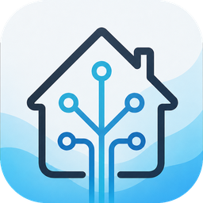

<div align="center">
  
  <h1>HomeBar</h1>
  <p>Deine Home-Assistant-Oberfläche direkt in der macOS-Menüleiste.</p>
  <p>
    <a href="https://github.com/Kalyro98/HomeBar/releases/latest/download/HomeBar.dmg"><b>⬇️ HomeBar herunterladen (DMG)</b></a>
    &nbsp;·&nbsp;
    <a href="https://github.com/Kalyro98/HomeBar/releases/latest">Alle Releases</a>
  </p>
</div>

---

**HomeBar** ist eine native macOS-Menüleisten-App, die deine **Home-Assistant-Weboberfläche**
(Dashboards & Einstellungen) in einem eingebetteten Fenster anzeigt – ganz ohne Browser. Beim
Überfahren des Menüleisten-Symbols klappt das Fenster auf, ein Klick fixiert es. Das Fenster ist
frei in der Größe ziehbar und merkt sich Größe und Position.

## Funktionen
- 🏠 Zeigt die **echte HA-Oberfläche** (Lovelace-Dashboards, Einstellungen) im `WKWebView` – Login
  läuft direkt auf der HA-Seite und bleibt gespeichert.
- 🖱️ **Hover öffnet**, Klick **pinnt** das Fenster, Klick daneben schließt es.
- ↔️ **Frei skalierbares** Fenster; Größe & Position werden gemerkt.
- 🌐 **Lokal + Remote**: frei eingebbare lokale URL und Remote-Domain, mit automatischem Fallback.
  In den Einstellungen zeigt ein **grünes Häkchen**, welche Adresse gerade verbunden ist.
- 🚀 Optionaler **Autostart bei Anmeldung** (über `SMAppService`).
- ⌨️ **Globaler Shortcut ⌘⇧H** zum Öffnen/Schließen von überall.
- 🔔 **Native Benachrichtigungen** für ausgewählte Entitäten (z. B. „Tür offen", „Waschmaschine fertig").
- 🔒 Unterstützt lokale HA-Server über **http** und **self-signed HTTPS**.
- 🖱️ **Rechtsklick** aufs Symbol → Menü mit „Öffnen" und „Beenden".
- 🌍 **Zweisprachig** (Deutsch/Englisch) – automatisch nach Systemsprache.
- 🧭 Reine Menüleisten-App (kein Dock-Icon).

## Voraussetzungen
- macOS 14.0 oder neuer
- Eine erreichbare Home-Assistant-Instanz
- Zum Selbst-Bauen: Xcode 16 oder neuer

## Installation
1. Das [`HomeBar.dmg`](https://github.com/Kalyro98/HomeBar/releases/latest/download/HomeBar.dmg) laden (immer die neueste Version).
2. DMG öffnen und **HomeBar** in den **Programme**-Ordner ziehen.
3. Beim ersten Start (App ist nicht signiert): **Rechtsklick auf HomeBar → „Öffnen"** und im Dialog
   bestätigen. Danach startet sie normal.

## Einrichtung
1. Auf das Menüleisten-Symbol klicken → **Zahnrad** (Einstellungen).
2. **Lokale URL/IP** (z. B. `http://192.168.1.50:8123`) und/oder **Remote-Domain** eintragen → **Speichern & Laden**.
3. Auf der geladenen HA-Seite ganz normal einloggen – die Anmeldung bleibt gespeichert.
4. **Optional – Benachrichtigungen:** In Home Assistant unter *Profil → Sicherheit* ein
   **Long-Lived Access Token** erzeugen, in den Einstellungen eintragen, „Benachrichtigungen
   aktivieren" einschalten und die gewünschten Entitäten auswählen.

Mit **⌘⇧H** öffnest/schließt du HomeBar von überall.

## Aus dem Quellcode bauen
```bash
# In Xcode öffnen und ausführen:
open HomeBar.xcodeproj

# Oder per Kommandozeile:
xcodebuild -project HomeBar.xcodeproj -scheme HomeBar -configuration Release build
```

### DMG erzeugen
```bash
# Einmalig für das gestylte DMG-Layout:
python3 -m pip install --user dmgbuild

./scripts/build-dmg.sh          # Ergebnis: dist/HomeBar.dmg
```
Das Skript baut die Release-Version und packt sie mit **dmgbuild** in ein gestyltes DMG
(Hintergrundbild, große Icons, Drag-to-Applications). Ohne `dmgbuild` entsteht ein einfaches,
ungestyltes DMG.

## Hinweise
- Die App ist **nicht signiert/notarisiert** (für den persönlichen Gebrauch gedacht) – daher der
  Rechtsklick→Öffnen beim Erststart.
- Beim ersten lokalen Netzwerkzugriff fragt macOS ggf. um Erlaubnis (lokales Netzwerk) – einmalig bestätigen.

## Lizenz
[MIT](LICENSE) © 2026 Dino

> *Home Assistant ist ein Projekt der Open Home Foundation. HomeBar ist ein inoffizieller,
> eigenständiger Client und steht in keiner Verbindung zum Home-Assistant-Projekt.*
